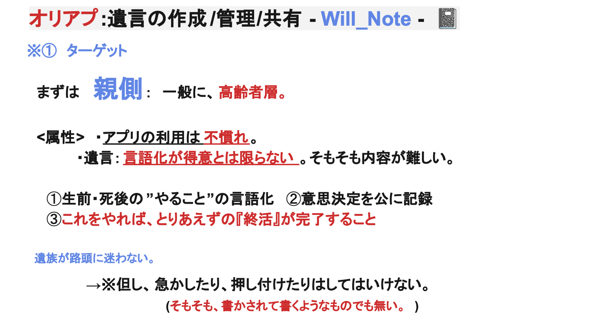
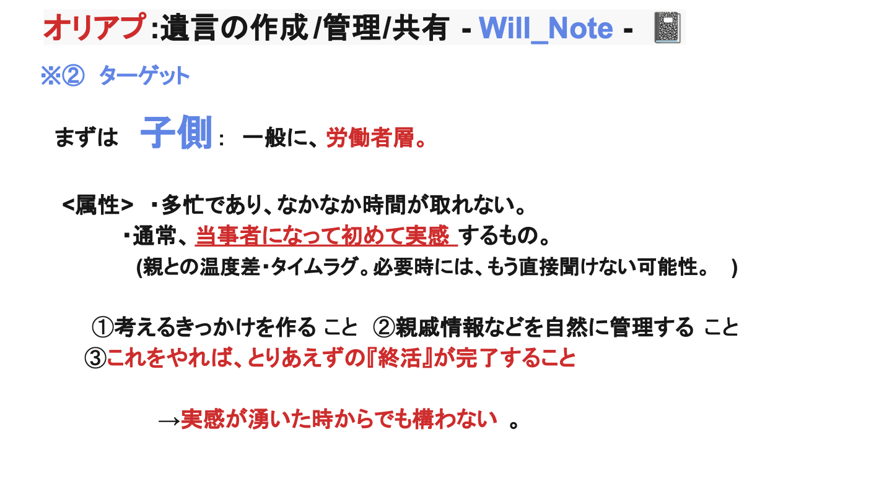
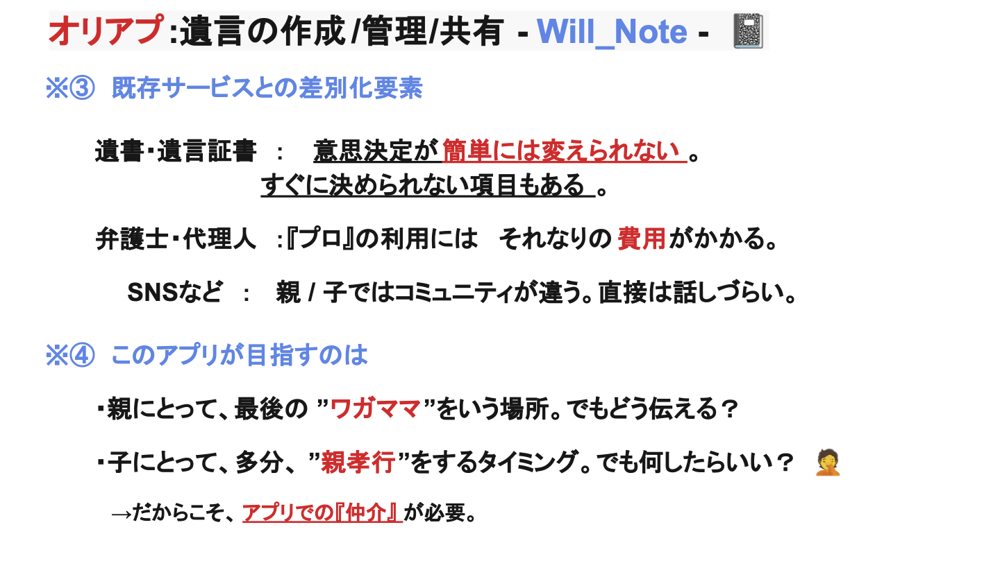
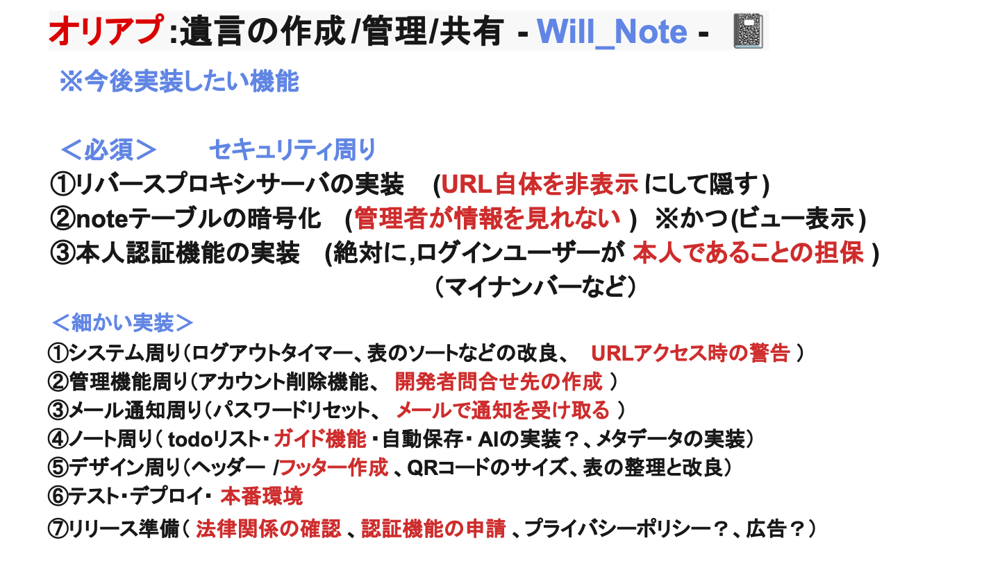
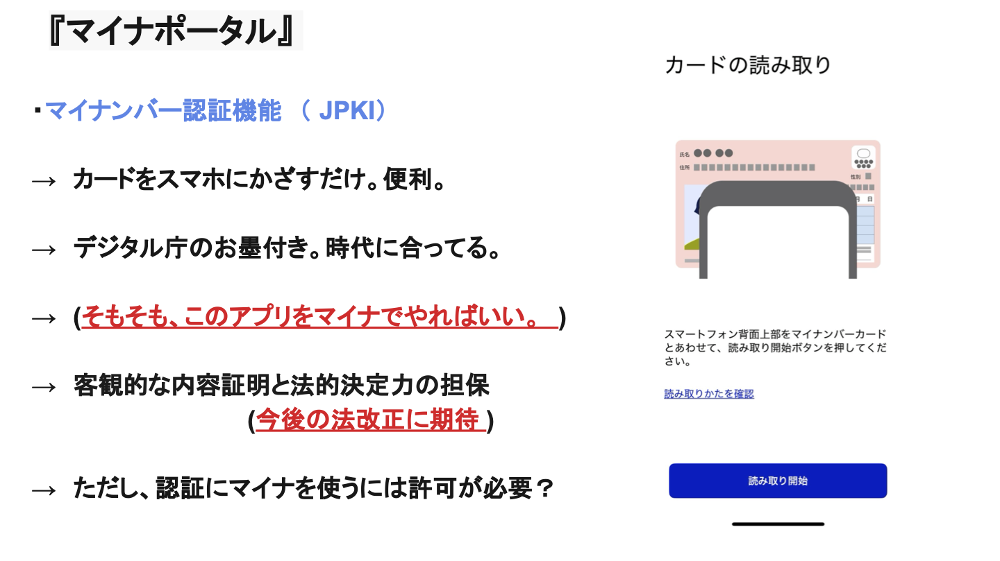
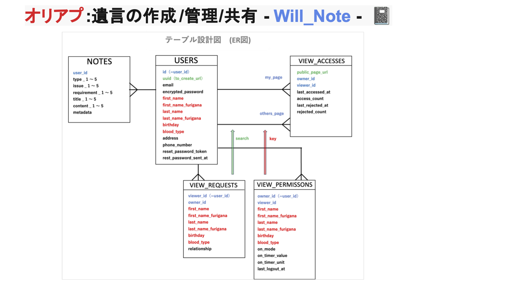
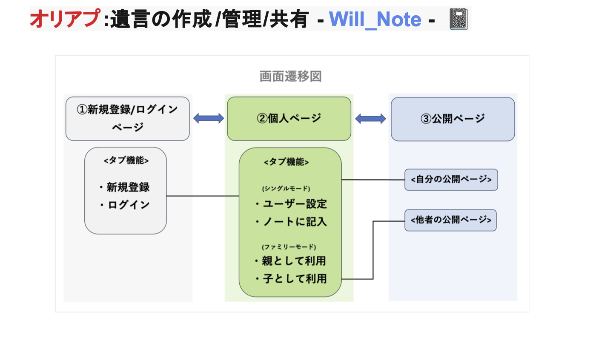
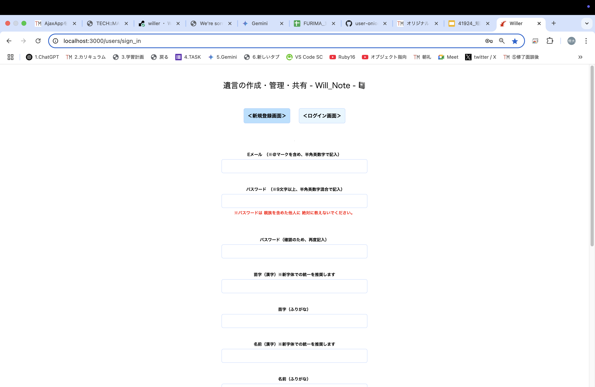
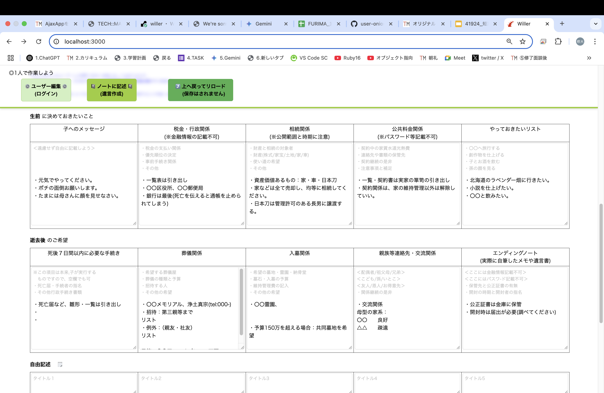
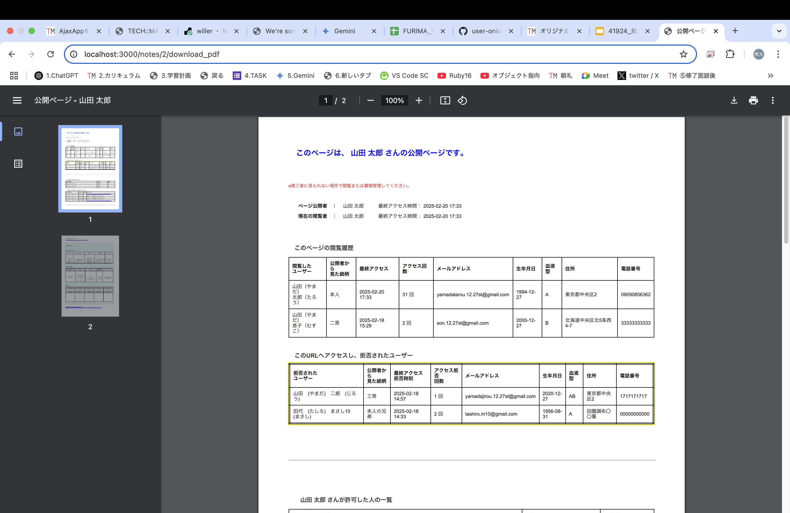

## アプリケーション名
遺言の作成/管理/共有 - Will_Note -  📓　　（ウィルノート）


## アプリケーション概要
・親側：遺言の言語化と作成をサポートし、子に記録を遺す。<br>
・子側：必要時に親側の情報を検索し、”親の意思を尊重した遺言執行”をサポート。


## URL
https://willer.onrender.com


## テスト用アカウント
・Basic認証ID：admin<br>
・Basic認証パスワード：2222<br>
・メールアドレス：test＠test<br>
・パスワード：admin2222


## 利用方法
親側：①新規登録　②遺言情報を記入　③指定した子の閲覧を許可<br>
子側：①新規登録　②指定した親を検索　③親の遺言を管理・執行


## アプリケーションを作成した背景
親側：いつかはやってくる自分の命日。”終活”という言葉を最近耳にするが、結局、何から始めたらいいか分からない。一度子と話さなればいけないと思っているが、機会が作れない。仮に会えても話しづらい。<br>

子側：いつかはやってくる家族の命日。”喪主や遺族代表者”になったら、何をしたらいいのだろうか。一度親と話さなければいけないと思っているが、時間が取れない。仮に会えても、死後の話など聞きづらい。そもそも今自分にできる親孝行ってなんだろう？<br>

→そんな社会問題・ディスコミュニケーションを解決すべく、親子をつなぐ『仲介』としての手段が必要と考えた。


## ターゲット層・差別化・目指すゴール（画像説明）



<br>
<hr>



<br>
<hr>




<br>


## 今後実装予定の機能
・公開ページURLの非表示化（リバースプロキシサーバ）<br>
　→閲覧者全員にURLを表示させないことで、SNSでの拡散を防ぐ<br><br>
・NOTESテーブルの暗号化（ビュー表示は可能なまま）<br>
　管理者がノートの内容を見られないようにする→<br><br>
・マイナンバー認証機能（JPKI）の申請と導入<br>
　→ニックネーム・捨てアカウントでの利用を防ぎ、ログインユーザーが間違いなく本人であることを担保する



<br>
<hr>



<br>


## テーブル設計図・画面



<br>
<hr>



<br>


## アプリの操作画面



<br>
<hr>


<br>
<hr>



<br>
<hr>



<br>


## 開発環境
・フロントエンド　（HTML・CSS・JavaScript・Ruby）<br>
・バックエンド　（MySQL、）<br>
・インフラ　（）<br>
・テスト　（）<br>
・テキストエディタ　（）<br>
・タスク管理　（GitHub）


## ローカルでの動作方法
・git clone https://github.com/xxxxxxxxxx<br>
・cd xxxxxxxxxxx<br>
・bundle install<br>
・rails db:create<br>
・rails db:migrate


## 工夫したポイント
・利用者のニーズに沿った設計を実装<br>
→恐らく、親と子ではアプリの利用時期が異なる。そのタイムラグをあらかじめ考慮し、”いつ始めても機能する”よう設計した。<br>
・シンプルかつ実用的な機能のみ採用<br>
→要件をなすための必要な機能を選別し、必要最小限だけを実装。


## 改善点
・”今後の実装予定”に記載したセキュリティ対策関連の実装<br>
・CSSのデザイン改良<br>
・ボタン入力時の確認・エラーメッセージの改良<br>
・リストの表示・非表示の管理<br>
・開発者問合せ先実装


## 制作時間
・約３週間　(2/1〜21)　本番環境1回目提出<br>
 ※ 以降も継続改良中


ーーーーーーーーーーーーーーーーーーーーーーーーーーーーーーーーーーーーーーーーーーーーー


# テーブル設計 （詳細）

## 1.users テーブル（ユーザー情報）
| Column                        | Type   | Options     |
| ----------------------------- | ------ | ----------- |
| uuid                          | string | null: false, unique: true |
| email                         | string | null: false, unique: true |
| encrypted_password            | string | null: false |
| first_name                    | string | null: false |
| first_name_furigana           | string | null: false |
| last_name                     | string | null: false |
| last_name_furigana            | string | null: false |
| birthday                      | date   | null: false |
| blood_type                    | string | null: false |
| address                       | string | null: false |
| phone_number                  | string | null: false, unique: true |
| reset_password_token          | string | null: false, unique: true |
| reset_password_sent_at        | datetime | null: true |
| remember_created_at           | datetime | null: true |
| last_logout_at                | datetime | null: true |
| created_at                    | datetime | null: false (t.timestamps) |
| updated_at                    | datetime | null: false (t.timestamps) |


### 1.Association
has_many :notes
has_many :view_permissions, foreign_key: :owner_id, dependent: :destroy
has_many :view_requests, foreign_key: :user_id, dependent: :destroy
has_many :view_accesses_as_owner, class_name: 'ViewAccess', foreign_key: :owner_id, dependent: :destroy
has_many :view_accesses_as_viewer, class_name: 'ViewAccess', foreign_key: :viewer_id, dependent: :destroy


## 2. view_permissions テーブル（閲覧許可情報）
| Column                   | Type       | Options                                   |
| ------------------------ | ---------- | ----------------------------------------- |
| owner_id                 | bigint     | null: false, foreign_key: { to_table: :users } |
| viewer_id                | bigint     | null: false, foreign_key: { to_table: :users } |
| first_name               | string     | null: false |
| first_name_furigana      | string     | null: false |
| last_name                | string     | null: false |
| last_name_furigana       | string     | null: false |
| birthday                 | date       | null: false |
| blood_type               | string     | null: false |
| on_mode                  | string     | null: false, default: “許可” |
| on_timer_value           | integer    | null: false, default: 1 |
| on_timer_unit            | string     | null: false, default: “day” |
| last_logout_at           | datetime   | null: true |


### **2. Association**
belongs_to :owner, class_name: 'User', foreign_key: 'owner_id'
belongs_to :viewer, class_name: 'User', foreign_key: 'viewer_id'


## 3. view_requests テーブル（閲覧申請情報）
| Column              | Type       | Options                                         |
| ------------------- | ---------- | ----------------------------------------------- |
| user_id             | references | null: false, foreign_key: true                 | # 閲覧者
| first_name          | string     | null: false                                    |
| first_name_furigana | string     | null: false                                    |
| last_name           | string     | null: false                                    |
| last_name_furigana  | string     | null: false                                    |
| birthday            | date       | null: false                                    |
| blood_type          | string     | null: false                                    |
| relationship        | string     | null: false                                    |


### **3. Association**
belongs_to :user


## 4. view_accesses テーブル（閲覧アクセス情報）
| Column           | Type       | Options                                         |
| ---------------- | ---------- | ----------------------------------------------- |
| public_page_url  | string     | null: true                                      |
| owner_id         | bigint     | null: false, foreign_key: { to_table: :users }  | # 公開者
| viewer_id        | bigint     | null: false, foreign_key: { to_table: :users }  | # 閲覧者
| last_accessed_at | datetime   | null: true                                      |
| access_count     | integer    | null: false, default: 0                         |
| last_rejected_at | datetime   | null: true                                      |
| rejected_count   | integer    | null: false, default: 0                         |


### **4. Association**
belongs_to :owner, class_name: 'User', foreign_key: 'owner_id'
belongs_to :viewer, class_name: 'User', foreign_key: 'viewer_id'


**✅ インデックス追加**
```ruby
add_index :view_accesses, [:owner_id, :viewer_id], unique: true
```


## 5.notes テーブル（遺言データ）
| Column             | Type       | Options                        |
| ------------------ | ---------- | ------------------------------ |
| user_id            | references | null: false,foreign_key: true  |
| type_1             | string     | null: true                     |
| type_2             | string     | null: true                     |
| type_3             | string     | null: true                     |
| type_4             | string     | null: true                     |
| type_5             | string     | null: true                     |
| issue_1            | string     | null: true                     |
| issue_2            | string     | null: true                     |
| issue_3            | string     | null: true                     |
| issue_4            | string     | null: true                     |
| issue_5            | string     | null: true                     |
| requirement_1      | string     | null: true                     |
| requirement_2      | string     | null: true                     |
| requirement_3      | string     | null: true                     |
| requirement_4      | string     | null: true                     |
| requirement_5      | string     | null: true                     |
| title_1            | string     | null: true                     |
| title_2            | string     | null: true                     |
| title_3            | string     | null: true                     |
| title_4            | string     | null: true                     |
| title_5            | string     | null: true                     |
| content_1          | text       | null: true                     |
| content_2          | text       | null: true                     |
| content_3          | text       | null: true                     |
| content_4          | text       | null: true                     |
| content_5          | text       | null: true                     |
| metadata           | json       | null: true                     |


### 5.Association
belongs_to :user

